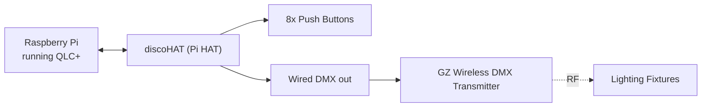
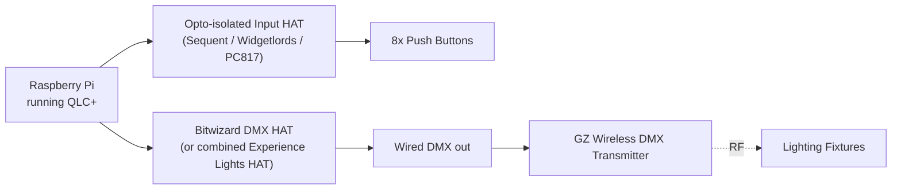
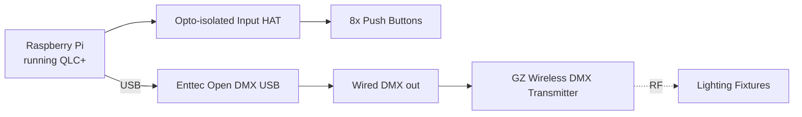
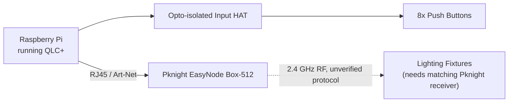
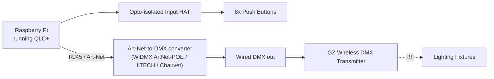

# DiscoPi

A small standalone lighting-control box: a Raspberry Pi with 8 physical buttons that trigger scenes, chases, and shows via [QLC+](https://www.qlcplus.org/). No screen, keyboard, or mouse needed on stage — just press a button.

## Plan (Option A — preferred)

- **Raspberry Pi** running [QLC+](https://www.qlcplus.org/) ([source on GitHub](https://github.com/mcallegari/qlcplus))
- **[discoHAT](https://www.discohat.com/)** — a HAT purpose-built for QLC+, with onboard push buttons and GPIO breakout ([pinout reference](https://pinout.xyz/pinout/discohat))
- **8 buttons** wired to GPIO, each mapped to a QLC+ Virtual Console button (scene, chase, or function trigger)
- Everything enclosed in a compact box

**Availability:** discoHAT is small-batch, hobbyist hardware made by one developer, and the [discohat.com](https://www.discohat.com/) shop is currently closed/not listing an order page — the site itself notes it "is being updated due to technical reasons." No listing found on Tindie, eBay, or Etsy either.

- **Maker:** Karri Kaksonen, forum handle `karrika` (Finland) — [GitHub](https://github.com/karrika), active on the [Raspberry Pi forums](https://forums.raspberrypi.com/) and [QLC+ forums](https://www.qlcplus.org/forum/) since 2015. No discoHAT hardware source files (KiCad/Gerbers) are public on the GitHub profile, so self-fabbing isn't currently an option either.
- **Best way to check current availability:** email **info@discohat.com** directly, or reply/PM on the [DiscoHAT and DiscoCap thread](https://forums.raspberrypi.com/viewtopic.php?t=133228) on the Raspberry Pi forums, where karrika has answered stock questions before.
- **Last discoHAT-specific post found:** Aug 7, 2017, on that same thread — *"I hope to have the boards in the shop again shortly."* Batches have historically been small and made on request rather than kept in continuous stock.
- karrika is still active on the Raspberry Pi forums generally (last seen post Oct 31, 2023, on an unrelated topic), so a direct message is likely to get a reply even though the shop page is stale.

Given this, treat Option A as "ask first, don't assume it's buyable" — Option B below is the practical fallback while waiting on a reply.

## Plan (Option B — HAT with DMX on it)

Looked for an existing board that does roughly what discoHAT does (DMX out + button inputs on one Pi HAT, in stock today). Nothing matches discoHAT exactly, but these have DMX output built into the HAT itself:

- **[Bitwizard DMX interface for Raspberry Pi](https://www.bitwizard.nl/shop/DMX-interface-for-Raspberry-pi)** — a proper Pi HAT (not a USB dongle), €29.95, in stock, explicitly QLC+/OLA-compatible. DMX output only — no button inputs, no isolation on those — so it still needs pairing with one of the opto-isolated input HATs from Option C below for the 8 buttons.
- **[Experience Lights "In & Out" Pi HAT](https://store.experiencelights.com/raspberry-pi-in-out-hat-input-extender-pixel-output/)** — combines DMX output *and* 6 (expandable to 12) input triggers on a single board, $58.99–$146.97, in stock. Tempting as a true one-board alternative, but two caveats: the product page doesn't mention any opto-isolation on the inputs, and it's built for the holiday-lighting ecosystem (xLights/Falcon Player), not QLC+ — compatibility with QLC+'s GPIO plugin isn't confirmed and would need testing before relying on it.
- Also checked the **L4e - DMX LIGHTSPOT** Pi HAT (isolated DMX outputs, mentioned on the QLC+ forum) — the project appears stalled: first boards built Jan 2021, but forum questions in 2022 about reaching production went unanswered. Not currently purchasable, so not a real option.

Bitwizard is the safer bet of the three — in stock, cheap, confirmed QLC+ compatible — but it means stacking it with a second HAT for the buttons.

## Plan (Option C — HAT without DMX on it)

Here the Pi HAT's only job is the 8 opto-isolated button inputs; DMX output is handled by a separate module entirely, so there's no DMX hardware sharing the HAT with the buttons.

**Input HAT options (shared by both sub-options below):**
- [Sequent Microsystems Eight HV Digital Inputs HAT](https://sequentmicrosystems.com/products/eight-hv-digital-inputs-for-raspberry-pi) — exactly 8 opto-isolated inputs
- [Widgetlords Pi-SPi-8DI](https://widgetlords.com/products/pi-spi-8di-raspberry-pi-digital-input-interface) — 8 isolated inputs per board, stackable
- **Cheap DIY alternative (AliExpress):** [PC817 8-channel optocoupler isolation board](https://www.aliexpress.com/item/32964487766.html) — a few dollars, 3.3 V-compatible, but a bare breakout (not a Pi HAT), so it needs manual wiring (a [GPIO screw-terminal breakout board](https://www.aliexpress.com/item/1005010676647519.html) helps). No dedicated cheap opto-isolated Pi HAT was found on AliExpress.

Buttons wired to the isolated-input HAT (or PC817 board), read via QLC+'s GPIO/input plugin, in both sub-options below.

### C1 — DMX (wired), via Enttec

- **[Enttec Open DMX USB](https://www.enttec.com/product/dmx-usb-interfaces/open-dmx-usb/)** — external USB DMX dongle, plugs straight into the Pi, no HAT slot used ([QLC+ setup guide](https://support.enttec.com/dmx/usbdmx-open-dmx-usb-70303/open-dmx-usb-with-qlc), [QLC+ forum thread](https://www.qlcplus.org/forum/viewtopic.php?t=15367))
- Output is standard wired DMX, so it feeds directly into the plain **GZ-protocol wireless DMX transmitter** described in the "Wireless DMX module" section below — no extra conversion needed.

### C2 — Art-Net over wired Ethernet (RJ45)

- **[Art-Net](https://docs.qlcplus.org/v4/plugins/art-net)** — QLC+'s built-in Art-Net output plugin sends DMX-over-network out the Pi's RJ45 Ethernet port; no DMX hardware on the Pi at all, and no Wi-Fi involved (Art-Net over Wi-Fi is broadly discouraged anyway — broadcast traffic overloads wireless links).
- Two ways to get from that Ethernet Art-Net signal to wireless DMX at the fixtures:
  - **One combined box:** a single device with an RJ45 Art-Net input that outputs wireless DMX directly.
    - [Pknight EasyNode Box-512](https://www.pknightpro.com/products/pknight-easynode-box-512) — has both an RJ45 Ethernet input and Wi-Fi (Ethernet can be used on its own, Wi-Fi left off), bidirectional Art-Net/sACN, 2.4 GHz wireless DMX out (1 universe)
    - **Caveat:** could not confirm this (or any other single-box Art-Net-in/wireless-out product found) actually speaks the generic **GZ protocol** on its wireless side — it's more likely Pknight's own 2.4 GHz ecosystem, so the receiving fixture would need a matching Pknight receiver rather than any GZ-compatible built-in one. No verified single box was found that does "RJ45 Art-Net in → GZ wireless DMX out" — treat this path as unconfirmed until tested.

  - **Two boxes (verified, GZ-compatible):** a wired Ethernet Art-Net-to-DMX converter, then its wired DMX output feeds a separate GZ transmitter — same GZ hardware as C1, just with an Art-Net converter in front of it instead of the Enttec dongle:
    - [WiDMX ArtNet-POE](http://www.widmx.com/en/products_view.asp?id=21) — RJ45 (PoE) Art-Net-to-DMX converter, 2 universes, RDM — pairs naturally with WiDMX's own GZ-protocol wireless transceivers (LC-512M/X) below, same manufacturer for both hops
    - [LTECH ArtNet-DMX-2](https://www.amazon.com/ArtNet-DMX-2-ArtNet-DMX512-Ethernet-Universe/dp/B07S5XDL8Y) or [Chauvet DMX-AN2](https://www.bopdj.com/chauvet-dmx-an2-art-net-sacn-converter.html) — Ethernet-only Art-Net-to-DMX nodes, also work, then feed the same GZ transmitter as C1

- This two-box path is the reliable, confirmed-GZ-compatible way to do Art-Net → wireless DMX with no Wi-Fi; the one-box option is more convenient but its wireless protocol compatibility is unverified.

## Wireless DMX module (needed for C1, and for C2's two-box path)

Whichever HAT/DMX-source combo gets picked (A, B, or C1, or C2's two-box path), the run from the box to the actual fixtures should be wireless rather than a physical DMX cable. That means the wired DMX output needs to feed into a **wireless DMX transmitter** before it reaches the lights. (C2's one-box option skips this section — its Ethernet-to-wireless conversion is built in, just using an unverified/vendor-specific protocol instead of confirmed GZ.)

- **"GZ" protocol** — short for the Guangzhou protocol, the de-facto standard used by most cheap Chinese wireless DMX gear. It's not the same as the Swedish [W-DMX / G5](https://lumenradio.com/wireless-dmx/crmx-products/) protocol from Wireless Solution/LumenRadio (official G5 hardware runs $300–$560+ per unit, e.g. the [Micro F-1 G5](https://www.fullcompass.com/prod/543766-wireless-solution-a40006g5-micro-f-1-g5-dmx-rdm-transceiver)) — GZ is the budget alternative most AliExpress/no-name transmitters and many affordable moving heads/pars already speak.
- GZ transceivers use a simple 8051 MCU + RF IC design (fixed frequency, 7 DMX groups selectable by button), which is why they're cheap but also why they're more prone to interference/delay than G5 — fine for a small home/hobby setup, less so for a crowded venue.
- **[WiDMX](http://www.widmx.com/en/products.asp?main_id=1)** — a Chinese manufacturer whose transceivers (LC-512M, LC-512X, LC-512G, etc.) explicitly support both GZ protocol and the Swedish G3/G4 protocol, switchable by button — a good option if compatibility with a mix of budget and semi-pro fixtures matters. No price found on the site directly; check with WiDMX or a distributor.
- Most of the **generic 2.4 GHz wireless DMX transmitter/receiver kits on AliExpress** (roughly $16–40, e.g. searches for "wireless dmx transmitter receiver DMX512") are unbranded GZ-protocol hardware under the hood, even when the listing doesn't say "GZ" explicitly — that's the common baseline chipset for this price range, and it's why unrelated brands' cheap wireless DMX gear tends to interoperate.
- **Practical takeaway:** any of the cheap AliExpress 2.4 GHz DMX transmitter/receiver kits should work as the wireless hop, since they're almost certainly GZ-protocol already; WiDMX is worth it specifically if you also need G3/G4 (Swedish-protocol) interoperability. True G5 fixtures/receivers won't talk to GZ hardware — check what protocol any fixture's *built-in* wireless receiver actually speaks before assuming a GZ transmitter will reach it.

